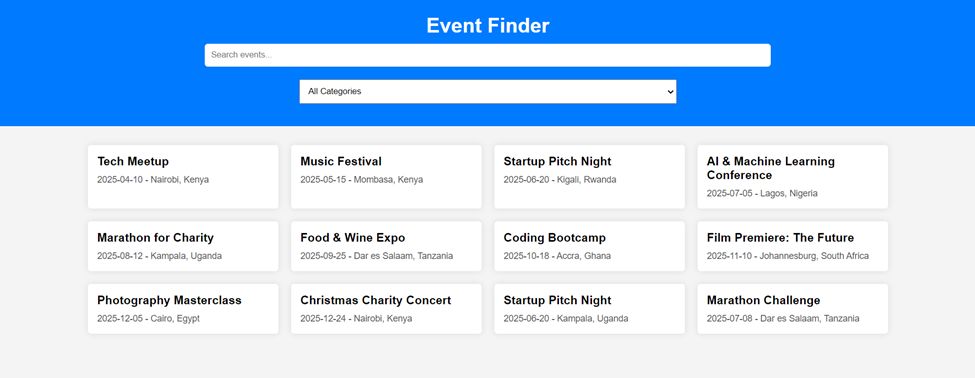
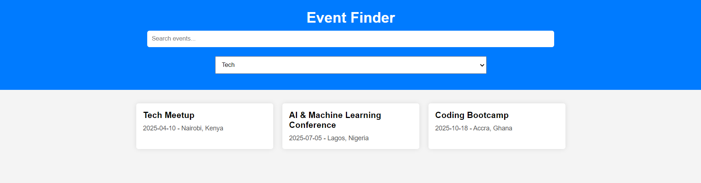
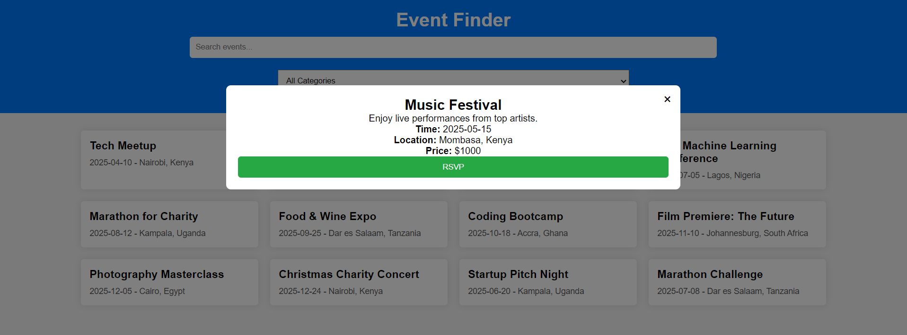

# Event-Finder-Project-Phase-1
Event Finder is a user-friendly web application that allows users to browse and discover upcoming local events based on their interests. Whether you're looking for music festivals, tech meetups, sports events, or community gatherings, Event Finder provides an easy way to explore events happening near you.

# RSVP Term
RSVP stands for "Répondez s'il vous plaît", which is French for "Please respond." In event management, RSVPs allow organizers to track the number of attendees and plan accordingly.In an event finder app, an RSVP feature enables users to confirm their attendance at an event. The system updates the event details to reflect the number of attendees.

# 📝 Table of Contents
1.Installation
2.Usage
3.API Reference (if applicable)
4.Technologies Used
5.Screenshots (if applicable)
6.Contributing
7.License
8.Contact

# ✨ Features
1.Browse upcoming local events by category
2.Search for events by name or category
3.View event details such as date, time, location, and price
4.RSVP to events and track attendance
5.Dynamic and interactive UI for seamless user experience

# ⚙️ Installation How to install and set up the project locally.
- Clone the repository: git clone https://github.com/Larr-y1/Event-Finder-Project-Phase-1.git
                        cd event-finder
- Start the local server: json-server --watch db.json
- Open the project in your preferred code editor and start the development server using live-server 

# 🚀 Usage How to use your app after installation.
1.Enter a search term to find events by name.
2.Use the category dropdown to filter events.
3.Click on an event card to view details.
4.RSVP to events and receive confirmation.

# 🔌API Reference 
The app fetches data from a local db.json file using json-server. The following endpoints are available:
GET /events – Retrieves all events
GET /events/:id – Retrieves a specific event
PATCH /events/:id – Updates RSVP status for an event

# 🛠 Technologies Used
HTML, CSS, JavaScript – Frontend development
JSON Server – Mock backend for event data
Fetch API – Handling API requests

# 📸 Screenshots 
Here are some screenshots of the Event Finder app:
Homepage  

 Search Feature  

Rsvp Feature  

# Contributing
Contributions are welcome! To contribute:

Fork the repository
Create a new branch (git checkout -b feature-branch)
Make your changes and commit (git commit -m "Add new feature")
Push to your fork and submit a pull request

# 📜 License - This project is licensed under the MIT License - see the LICENSE file for details.

# Contact
For any inquiries or suggestions, feel free to reach out:
📧 Email: larry.otieno@student.moringaschool.com
🐙 GitHub: https://github.com/Larr-y1

