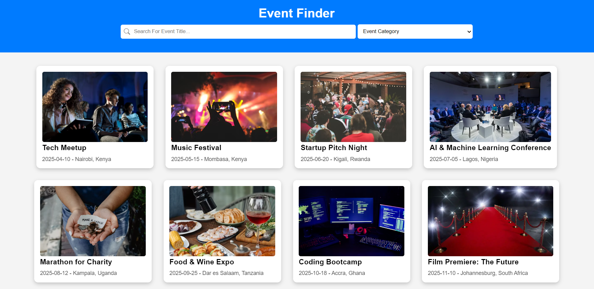
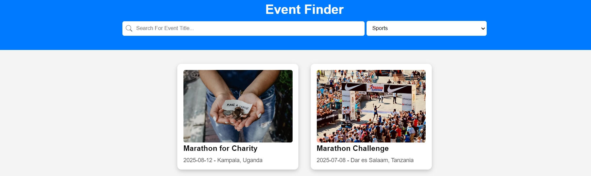
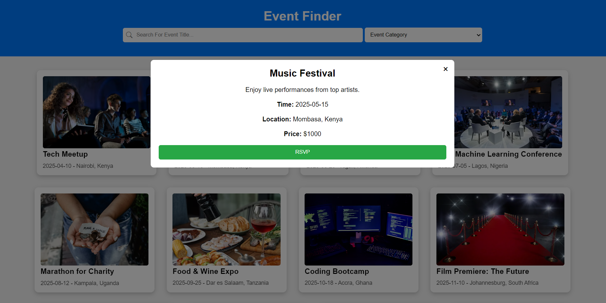
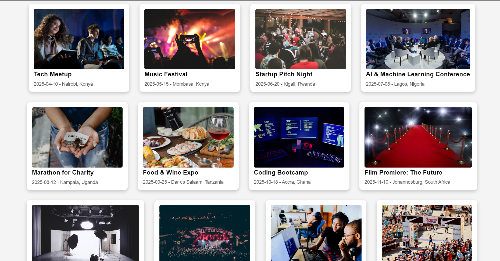
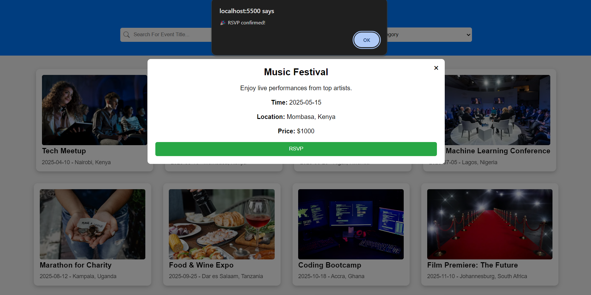

# Event-Finder-Project-Phase-1
Event Finder is a user-friendly web application that allows users to browse and discover upcoming local events based on their interests. Whether you're looking for music festivals, tech meetups, sports events, or community gatherings, Event Finder provides an easy way to explore events happening near you.

# RSVP Term
RSVP stands for "Répondez s'il vous plaît", which is French for "Please respond." In event management, RSVPs allow organizers to track the number of attendees and plan accordingly.In an event finder app, an RSVP feature enables users to confirm their attendance at an event. The system updates the event details to reflect the number of attendees.

# 📝 Table of Contents
- Installation
- Usage
- API Reference (if applicable)
- Technologies Used
- Screenshots (if applicable)
- Contributing
- License
- Contact

# ✨ Features
 - Browse Events – Explore upcoming local events categorized by type.
 - Search Functionality – Find events quickly by name.
 - Event Details – View essential details such as date, time, location, and price.
 - RSVP & Attendance Tracking – RSVP to events and keep track of attendance.
 - Dynamic UI – Enjoy a smooth and interactive user experience.

# ⚙️ Installation How to install and set up the project locally.
- Clone the repository: git clone https://github.com/Larr-y1/Event-Finder-Project-Phase-1.git
                        cd event-finder
- Start the local server: json-server --watch db.json
- Open the project in your preferred code editor and start the development server using live-server 

# 🚀 Usage How to use your app after installation.
- Search for Events – Enter a search term to find events by name.
- Filter by Category – Use the category dropdown to filter events.
- View Event Details – Click on an event card to see more details.
- RSVP to Events – RSVP to an event and receive confirmation.

# 🔌API Reference 
This application originally fetched data from a local db.json file using json-server. However, since GitHub Pages does not support local JSON files, we have migrated our event data to jsonbin.io, ensuring seamless data retrieval when the app is deployed.

Endpoints
# Local Development (Using JSON Server)
- GET /events – Retrieves all events
- GET /events/:id – Retrieves a specific event
- PATCH /events/:id – Updates RSVP status for an event

 # Production (Using jsonbin.io)
- GET /events – Retrieves all events
- GET /events/:id – Retrieves a specific event
- PUT /events/:id – Updates RSVP status for an event

Why jsonbin.io?
Hosting event data on jsonbin.io ensures the app remains fully functional when deployed on GitHub Pages, avoiding 404 and 401 errors that occur when trying to fetch local JSON files.

👉 API Base URL: https://api.jsonbin.io/v3/b/67e531888561e97a50f3da25

By leveraging jsonbin.io, the app provides a reliable and scalable way to serve event data without requiring a local server. 🚀

# 🛠 Technologies Used
This project was built using the following technologies:
  - HTML5 – For structuring the web pages
  - CSS3 – For styling and animations
  - JavaScript (ES6+) – For dynamic behavior and API interactions
  - Bootstrap – For responsive UI components
  - Animate.css – For smooth animations
  - JSON Server (local development) – To serve mock API data
  - jsonbin.io – To store and fetch event data in production
  - GitHub Pages – For hosting the project online

By leveraging these technologies, the app ensures a smooth and interactive user experience while remaining easy to maintain and deploy. 🚀

# 📸 Screenshots 
Here are some screenshots of the Event Finder app:
Homepage  

 Search Feature  

Rsvp Feature  

Events display

Alert message

# Contributing
Contributions are welcome! To contribute:

- Fork the repository
- Create a new branch (git checkout -b feature-branch)
- Make your changes and commit (git commit -m "Add new feature")
- Push to your fork and submit a pull request

# 📜 License 
- This project is licensed under the MIT License - see the LICENSE file for details.

# Contact
For any inquiries or suggestions, feel free to reach out:
📧 Email: larry.otieno@student.moringaschool.com
🐙 GitHub: https://github.com/Larr-y1

